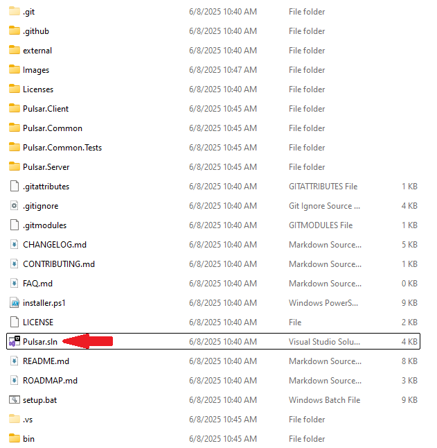
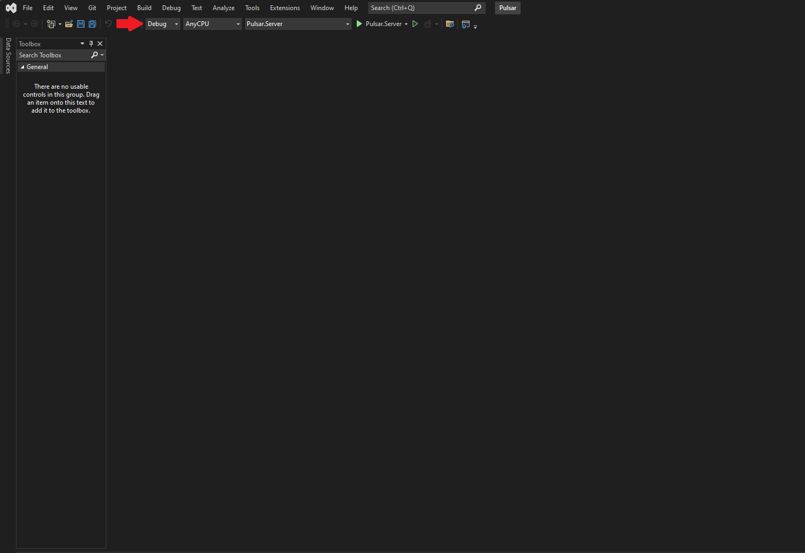
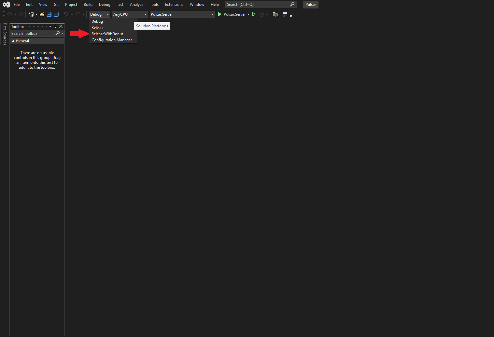
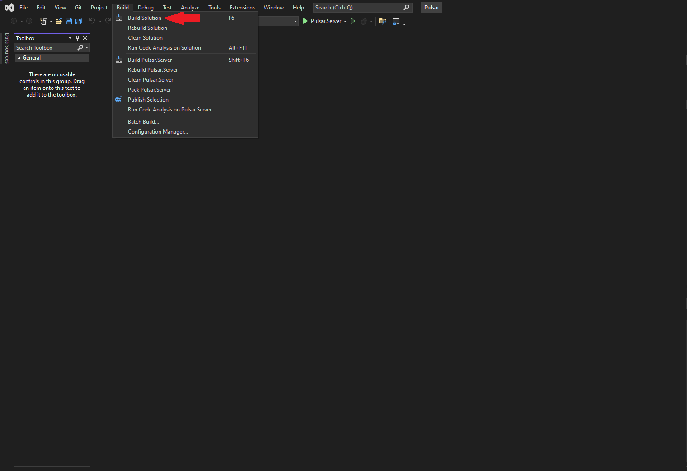
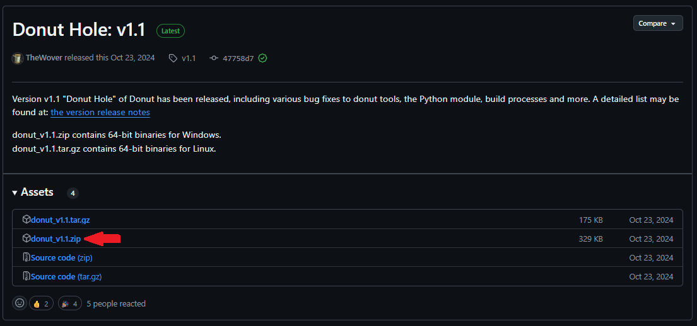
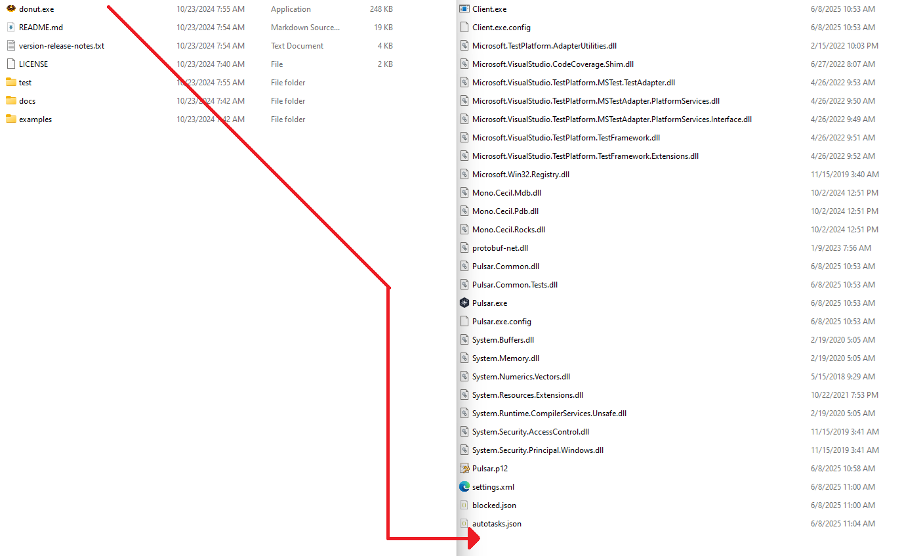

## 常见问题（FAQ）

### 目录

* [Shellcode 无法正常工作](#shellcode-not-working)

  * [启用 Shellcode 输出](#enabling-shellcode-outputs)
  * [替代构建方法](#alternative-build-process)

---

## Shellcode 无法正常工作

如果生成或执行 Shellcode 后没有得到预期结果，通常意味着项目在编译时**未启用 Shellcode 功能**。请按照以下步骤操作，确保构建配置包含 **Donut** 支持。

### 启用 Shellcode 输出

1. **打开解决方案**

   启动 Visual Studio，并打开 `Pulsar.sln`。

   

2. **选择构建配置**

   * 在工具栏中找到构建配置选择框（通常显示为 `Debug` 或 `Release`）。

     

   * 将其切换为 **ReleaseWithDonut**。

     

3. **编译解决方案**

   * 点击 **Build（生成）→ Build Solution（生成解决方案）**，或按下 **Ctrl + Shift + B**。

     

4. **验证输出**

   * 编译成功后，进入 `bin/Release` 目录。
   * 确认其中包含 Shellcode 转换工具文件（`donut.exe`）。

---

## 替代构建方法

如果无法使用 Visual Studio，或者标准构建失败，可以手动启用 Shellcode 输出功能。

1. **下载 Donut**

   * 前往 **Donut Releases** 页面。
   * 下载适用于当前操作系统的最新版本 `donut.exe`。

     

2. **解压文件**

   * 解压下载的压缩包，找到 `donut.exe`。

3. **复制到 Pulsar 输出目录**

   * 将 `donut.exe` 放入 Pulsar 的构建输出目录：

     ```text
     bin/ReleaseWithDonut
     ```

     

4. **验证手动配置**

   * 启动 Pulsar，确认 **Shellcode 构建（Build Shellcode）** 功能已启用。

---
